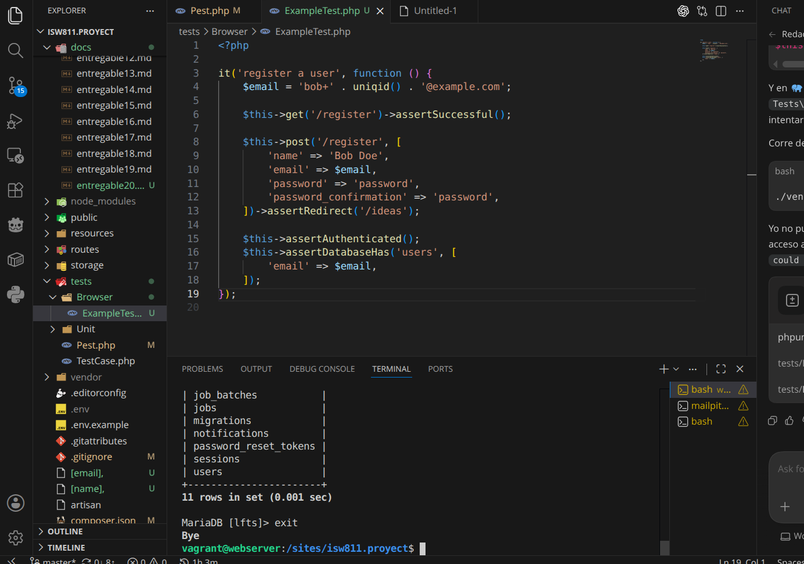
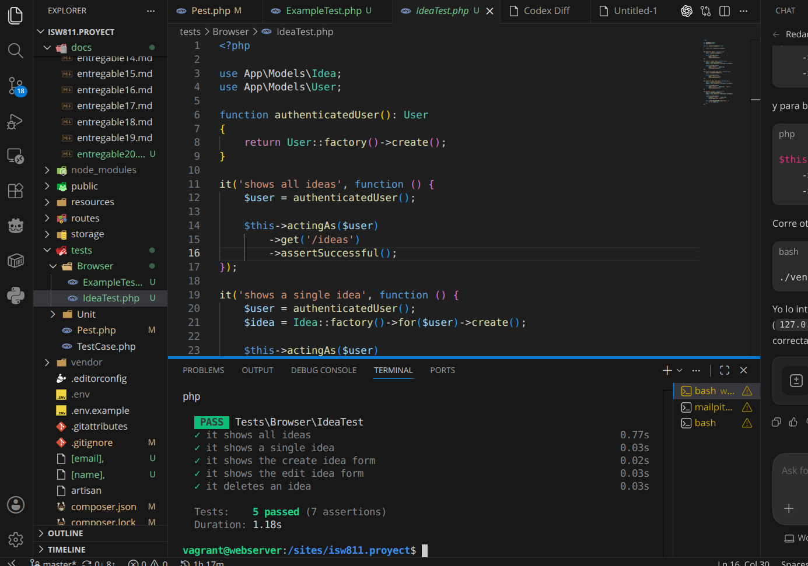

# Entregable 20

**Proyecto:** Laravel From Scratch 2026

---

## Episodio 20: How to Get Started Testing Your Code

### Resumen

En este episodio aprendimos a comenzar a probar el codigo de una aplicacion Laravel usando **PestPHP**. Se vio la importancia de crear pruebas automatizadas para verificar que las rutas, formularios y flujos principales de la aplicacion sigan funcionando correctamente despues de hacer cambios.

Tambien se practico la instalacion y uso de Pest para escribir tests con una sintaxis mas simple y legible. En lugar de probar todo manualmente desde el navegador, se crearon pruebas que hacen peticiones a la aplicacion, revisan respuestas exitosas, validan redirecciones y confirman que los datos se guarden o eliminen correctamente en la base de datos.

En la aplicacion se trabajaron dos grupos principales de pruebas: un test para el registro de usuarios y varios tests para el modulo de ideas. Con esto se reforzo como Laravel permite simular usuarios autenticados, crear datos de prueba con factories y validar el comportamiento esperado de las rutas protegidas.

---

### Conceptos aprendidos

- **Testing automatizado:** forma de comprobar que una parte de la aplicacion funciona sin tener que hacerlo manualmente cada vez.
- **PestPHP:** framework de testing para PHP que permite escribir pruebas con una sintaxis limpia.
- **Assertions:** validaciones que confirman si una respuesta o resultado es el esperado.
- **Factories:** clases que permiten crear datos falsos para pruebas, como usuarios e ideas.
- **actingAs():** metodo usado para simular que un usuario esta autenticado durante una prueba.
- **assertSuccessful():** verifica que una peticion regrese una respuesta exitosa.
- **assertRedirect():** verifica que una peticion redirija a una ruta especifica.
- **assertDatabaseHas() y assertDatabaseMissing():** validan si un registro existe o no existe en la base de datos.

---

### Instalacion y configuracion de Pest

Para trabajar con pruebas en el proyecto se instalo PestPHP y el plugin de Laravel:

```bash
composer require pestphp/pest --dev
composer require pestphp/pest-plugin-laravel --dev
```

Luego se configuraron los archivos de pruebas para que Pest pudiera usar el `TestCase` de Laravel y ejecutar los tests dentro de la carpeta `tests`.

Tambien se reviso la configuracion de `phpunit.xml`, especialmente las variables de entorno usadas durante las pruebas, como la conexion de base de datos, el driver de colas, el mailer y la sesion.

---

### Tests realizados

#### Test de registro

Se creo una prueba para validar el flujo de registro de usuarios. El test visita la ruta `/register`, envia los datos del formulario y verifica que el usuario sea redirigido a `/ideas`.

Ademas, se valida que el usuario quede autenticado y que el correo registrado exista en la tabla `users`.

Archivo relacionado:

- `tests/Browser/ExampleTest.php`

#### Tests de ideas

Tambien se crearon pruebas para validar las rutas principales del modulo de ideas. Como estas rutas estan protegidas por autenticacion, fue necesario usar `actingAs()` para simular un usuario logueado.

Se probaron los siguientes casos:

- Mostrar la lista de ideas.
- Mostrar una idea individual.
- Mostrar el formulario para crear una idea.
- Mostrar el formulario para editar una idea.
- Eliminar una idea usando la ruta `DELETE /ideas/{idea}`.

Archivo relacionado:

- `tests/Browser/IdeaTest.php`

---

### Comandos utilizados

```bash
composer require pestphp/pest --dev
composer require pestphp/pest-plugin-laravel --dev
php artisan test
./vendor/bin/pest
./vendor/bin/pest tests/Browser/ExampleTest.php
./vendor/bin/pest tests/Browser/IdeaTest.php
php artisan make:factory IdeaFactory
```

---

### Archivos modificados o creados

- `composer.json` -- dependencias de PestPHP y plugin de Laravel.
- `composer.lock` -- versiones instaladas de las dependencias.
- `tests/Pest.php` -- configuracion general de Pest.
- `tests/Browser/ExampleTest.php` -- test para el registro de usuarios.
- `tests/Browser/IdeaTest.php` -- tests para las rutas del modulo de ideas.
- `app/Models/Idea.php` -- se agrego soporte para factories con `HasFactory`.
- `database/factories/IdeaFactory.php` -- factory para crear ideas en las pruebas.
- `phpunit.xml` -- variables de entorno usadas durante los tests.

---

### Evidencia

- [ ] Captura de los tests principales ejecutados (`test.png`)
- [ ] Captura de los tests del CRUD de ideas (`crud_test.png`)





---

### Problemas encontrados y solucion

**Las rutas de ideas devolvian 302:** Esto ocurria porque las rutas `/ideas`, `/ideas/create`, `/ideas/{idea}` y `/ideas/{idea}/edit` estan protegidas por el middleware `auth`. Se soluciono usando `actingAs($user)` dentro de los tests para simular un usuario autenticado.

**El modelo `Idea` no podia usar factory:** El error aparecia porque el modelo no tenia el trait `HasFactory` y no existia una factory para crear ideas. Se soluciono agregando `HasFactory` en `app/Models/Idea.php` y creando `database/factories/IdeaFactory.php`.

**La ruta `/ideas/{idea}/delete` no existia:** El test intentaba visitar una ruta de borrado que no estaba definida. Se corrigio probando el comportamiento real de la aplicacion con una peticion `DELETE /ideas/{idea}`.

**Problemas con SQLite en testing:** Al usar `DB_CONNECTION=sqlite` y `DB_DATABASE=:memory:`, la VM fallo porque no tenia disponible el driver de SQLite. Se reviso la configuracion de `phpunit.xml` para usar una conexion compatible con el entorno del proyecto.

---

### Comentarios personales

Este episodio fue muy util porque mostro que los tests ayudan a encontrar errores rapidamente. Al escribir pruebas para registro e ideas, fue mas facil detectar detalles como rutas protegidas por autenticacion, factories faltantes y rutas que no existian realmente.

Pest hace que las pruebas sean mas faciles de leer y mantener. Tambien quedo claro que probar la aplicacion no solo sirve para confirmar que algo funciona, sino para documentar el comportamiento esperado del sistema.

---

### Apuntes para proximos episodios

Seguir agregando pruebas para los flujos principales de la aplicacion, especialmente crear ideas, actualizar ideas, validar permisos y revisar que los usuarios no puedan modificar datos que no les pertenecen.
