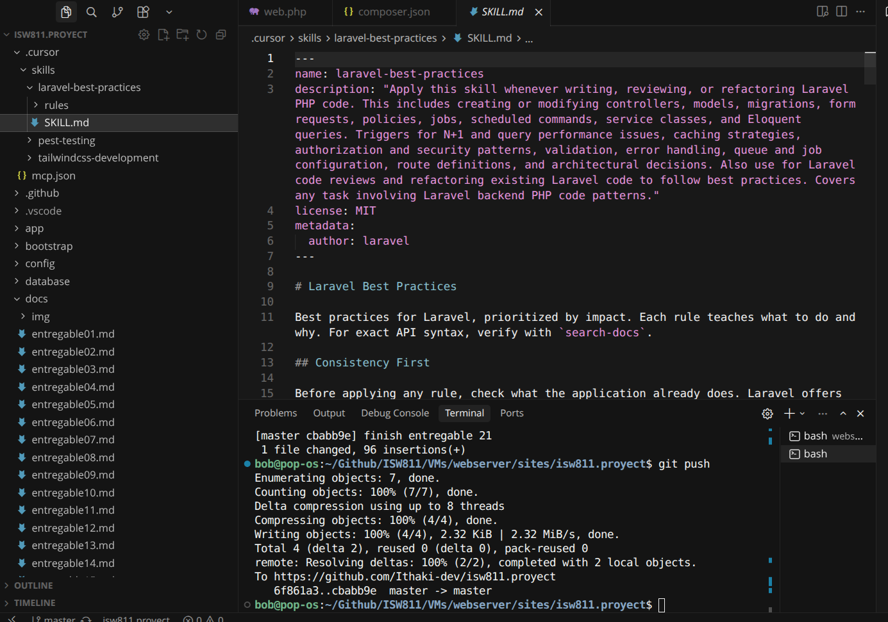

# Entregable 21

**Proyecto:** Laravel From Scratch 2026 — Proyecto final

---

## Episodio 21: Final Project Setup

### Resumen

En este episodio se dio inicio al **proyecto final** del curso. Se creó una aplicación Laravel nueva desde cero, reemplazando la aplicación de ideas que se había construido en los episodios anteriores. Con esto el repositorio cambió de enfoque: se eliminó el código del CRUD de ideas, autenticación y pruebas del proyecto anterior, y se partió de una instalación limpia de Laravel 12.

También se configuraron herramientas de desarrollo modernas para el nuevo proyecto. **Laravel Boost** se instaló para mejorar el flujo de trabajo con IA: guías del proyecto (`AGENTS.md`), skills especializados, servidor MCP y acceso a documentación versionada. **Rector** se agregó para refactorizar y modernizar código PHP de forma automatizada, junto con otras dependencias de desarrollo como Pint, Pest y Pail.

---

### Conceptos aprendidos

- **Reinicio del proyecto:** al iniciar el proyecto final conviene partir de una base limpia en lugar de seguir sobre la app de práctica del curso.
- **Laravel Boost:** paquete que integra guías, skills y MCP para que herramientas de IA entiendan mejor el proyecto Laravel.
- **AGENTS.md:** archivo con convenciones y reglas que la IA debe seguir al trabajar en el código.
- **Skills:** instrucciones especializadas por dominio (Laravel, Pest, Tailwind) que se activan según la tarea.
- **MCP (Model Context Protocol):** protocolo que permite a editores como Cursor consultar la base de datos, logs y documentación del proyecto.
- **Rector:** herramienta de refactorización automática para mantener el código PHP actualizado y con mejor calidad.
- **boost.json:** archivo de configuración que define qué componentes de Boost están habilitados (MCP, guidelines, skills, etc.).

---

### Comandos utilizados

```bash
laravel new isw811.proyect
composer require laravel/boost --dev
php artisan boost:install
composer require rector/rector driftingly/rector-laravel --dev
vendor/bin/rector process --dry-run
php artisan migrate
php artisan serve
composer run dev
```

---

### Archivos modificados o creados

**Aplicación nueva (reemplazo del proyecto anterior):**

- `routes/web.php` — ruta inicial con la vista de bienvenida de Laravel.
- `resources/views/welcome.blade.php` — vista por defecto del nuevo proyecto.
- `composer.json` / `composer.lock` — dependencias actualizadas para Laravel 12.
- `package.json` / `package-lock.json` — frontend con Vite y Tailwind CSS v4.

**Herramientas de desarrollo:**

- `boost.json` — configuración de Laravel Boost (MCP, guidelines, skills).
- `AGENTS.md` — guías y convenciones del proyecto para IA.
- `.cursor/mcp.json` — servidor MCP de Boost para Cursor.
- `rector.php` — configuración de Rector para refactorizar el código.
- `.cursor/skills/` — skills de Laravel, Pest y Tailwind.
- `.github/skills/` — copia de los skills para otros entornos.

**Archivos eliminados del proyecto anterior:**

- `app/Http/Controllers/IdeaController.php`
- `app/Models/Idea.php`
- `resources/views/ideas/`
- `tests/Browser/IdeaTest.php`
- Migraciones y factories relacionadas con ideas.

---

### Evidencia



---

### Problemas encontrados y solución

- **Cambio de repositorio:** la app de ideas del curso ya no correspondía al proyecto final, así que se creó una instalación nueva de Laravel y se conservaron solo los entregables en `docs/` como registro del avance del curso.
- **Configuración de Boost en Cursor:** fue necesario habilitar el servidor MCP en `.cursor/mcp.json` con `php artisan boost:mcp` para que el editor pueda consultar documentación, esquema de base de datos y logs del proyecto.
- **Entorno en la VM:** al igual que en episodios anteriores, el proyecto corre dentro de la máquina virtual con Vagrant, por lo que los comandos de Composer y Artisan se ejecutan desde `vagrant ssh`.

---

### Comentarios personales

Este episodio marca la transición del curso hacia el proyecto final. Fue útil entender que Laravel Boost no solo agrega un paquete más, sino que configura un entorno completo para trabajar con IA: documentación versionada, acceso a la base de datos, reglas de estilo y skills por área.

La instalación de Rector también abre la puerta a mantener el código más limpio y moderno sin refactorizar manualmente cada archivo. Partir de una app nueva da una base ordenada para construir el proyecto final sin arrastrar código de práctica que ya cumplió su propósito.

---

### Apuntes para próximos episodios

Construir las funcionalidades del proyecto final sobre esta base limpia, aprovechando Boost y Pest desde el inicio. Mantener el mismo formato de entregables en `docs/` para documentar cada episodio restante del curso.
